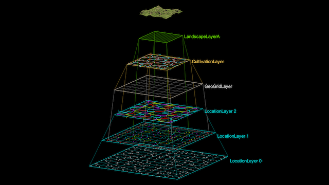

# Contextual Generation

A central purpose of the LayerProcGen framework is to support contextual generation while staying deterministic. Procedural operations can be performed across chunk boundaries, producing seamless results for context-based operations. For example:

- Distances between random points can be relaxed.
- Data in 2D arrays can be subject to blurring or other kernel-based filters.
- Pathfinding across chunk boundaries can be performed.

Contextual generation means having the following two traits at once:

- **Determinism**: The same chunk must always generate the same result, regardless of which order chunks are generated in.
- **Integrity**: The output of chunks must be continuous and seamless, the same as if all chunks had been generated simultaneously without any missing context.

The trait of determinism is possible by dividing the generation into multiple layers and keeping a strict separation between the input and output of each layer, as detailed on the page about [layer dependencies](LayerDependencies.md).

The trait of integrity is possible by supplying a chunk with sufficient context from lower layers, as detailed on the page about [effect distance and padding](EffectDistance.md).

The example below is meant to give a general idea of how layer-based contextual generation can be used, while other pages in the documentation go in more detail with how exactly it works.

## Example: Natural paths

It's possible to procedurally create natural-looking path through uneven terrain using a technique described in [this external article](https://blog.runevision.com/2016/03/note-on-creating-natural-paths-in.html). The technique is based on pathfinding, with a cost function that penalizes steepness. This can create path shapes such as switchbacks on steep terrain as an emergent behavior.

When using this technique for a world that's generated on the fly in chunks, we still want the generated paths to seamlessly cross chunk boundaries.

The following setup of layers with dependencies between each other is an example of how to do that.

The descriptions below reference various principles that will be introduced later on the [internal layer levels](InternalLayerLevels.md) page and the [software patterns for layers](Patterns.md) page.

A **LocationLayer** with three internal layer levels generates positions representing locations, and determines which of those positions should be connected by paths:

- Each chunk in **LocationLayer 0** generates three random initial positions.

- Each chunk in **LocationLayer 1** takes the initial positions from the corresponding chunk in LocationLayer 0 as input, as well as from the neighbor chunks. The distances between the positions are relaxed, and its own adjusted positions are saved as its output.

- **LocationLayer 2** generates data for which locations should be connected. The adjusted positions from its corresponding and neighbor chunks in LocationLayer 1 are used as input. Because the position data comes from a lower level, the chunk can plan connections between positions that come from multiple LocationLayer 1 chunks. To avoid ambiguous ownership of connections that overlap multiple chunks, the "owned within bounds" principle is used to determine if a chunk gets to store a given connection or discard it.

A **GeoGridLayer** generates initial terrain height data based on noise and flattens the terrain around the locations.

- The locations come from LocationLayer 1.

The heights are only calculated in a coarse grid used for pathfinding in the CultivationLayer. Height data at full resolution is calculated later in the LandscapeLayer within a smaller area.

A **CultivationLayer** generates path splines between connected locations based on pathfinding.

- The start and end points for the pathfinding are based on the connections from LocationLayer 2.
- The pathfinding cost function is based on the terrain heights from the GeoGridLayer.

Because all the input data comes from other layers, each chunk in the CultivationLayer can collect this data from a larger area than its own bounds. This means that paths can be planned even when they go partially outside of the chunk boundaries. Again the "owned within bounds" principle is used to determine which chunk calculates a path that goes across multiple chunks.

A **LandscapeLayerA** generates terrain chunks used for rendering and physics. Like the GeoGridLayer, it generates terrain height data based on noise (but at a higher resolution) and flattens it around the locations. It then flattens it around the paths too.

- The locations come from LocationLayer 1.
- The path splines come from the CultivationLayer.

Each LandscapeLayerA chunk collects all locations that overlap its bounds from the LocationLayer 1, and all paths that overlaps its bounds from the CultivationLayer, both based on the "overlapping bounds" principle. This way the path deformation in adjacent terrain chunks matches seamlessly.
