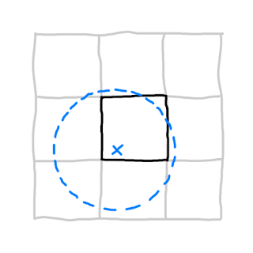
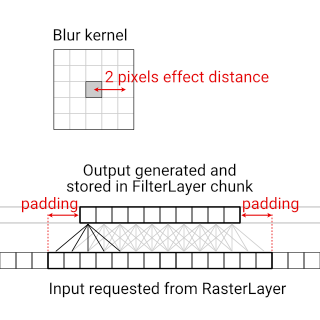
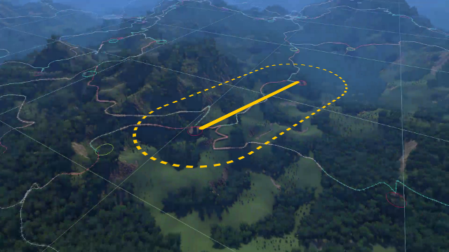

# Effect Distance and Padding

When a chunk in one layer requests data from another layer, the data is usually spatial, and the chunk needs at mimimum the data inside its own world space bounds.

If the chunk needs to do any kind of contextual processing, it'll need data covering a larger area than just its own bounds - the bounds need appropriate *padding*.

The padding needs to be specified in two ways in the code:

- When the chunk requests data from another layer within specified bounds.
- When specifying the layer dependency in the layer constructor.

In the layer dependency, the padding is always specified in world space units, for example:

```cs
// Code in layer's constructor. Specify a layer dependecy with
// horizontal and vertical padding of 16 world space units.
AddLayerDependency(
	new LayerDependency(OtherLayer.instance, new Point(16, 16)));
```

In the data request, the requested bounds (which should include padding) can be specified in world space units or in some other type of units if that's more convenient. This depends on how you design the request API.

```cs
// Code in chunk's Create method. Get points in chunk's own bounds
// plus horizontal and vertical padding of 16 world space units.
PointsLayer.instance.GetPointsInBounds(
	this, outPoints, bounds.GetExpanded(new Point(16, 16)));
```

How much padding is needed depends on what processing the chunk needs to do. This is where the concept of the *effect distance* comes into play.

## Effect distance

When doing contextual generation, we don't want discontinuities at the chunk edges. We want the end result to be continuous and seamless as if we had processed the entire (infinite) plane of data at once, even though it’s actually done chunk by chunk.

To ensure such integrity of the end result, we need to think about the *effect distance* of a contextual process. The effect distance is a measure of how far away input data can affect the output data at a given position.



This is how the appropriate amount of *padding* for a chunk's data request is decided: It must be large enough to fully encompass the effect distance of every point within the chunk. This means the padding must be at least as large as the effect distance.

## "Modifying" data

Some kinds of generation or processing that a chunk can do have the same type of input and output.

- Initial pixels → blurred pixels
- Initial point distances → relaxed point distances
- Initial terrain heights → eroded terrain heights

We can think of this as “modifying” data, even though the output is stored in a separate layer, and the input data remains untouched in the layer it came from.

Let's look at a few examples of how to determine the effect distance when "modifying" data.

## Example: Blurring data

Consider a RasterLayer which provides pixels based on a global deterministic pattern, and a FilterLayer that's responsible for calculating and storing a blurred version of the pattern.

If the output should be blurred by a 5 x 5 kernel, that's a blur radius of <span style="color:orange">2 pixels</span> and hence an *effect distance* of 2 pixels too.



We can design the data request API to take bounds in pixels rather than in world space units. In this case, we can calculate the pixel bounds corresponding to the output chunk, and then expand those by <span style="color:orange">2</span> in all directions to get the input pixel bounds.

However, when we specify the layer dependency in the layer constructor, the padding needs to be specified in world space units. If each FilterLayer chunk is <span style="color:purple">30 x 30 world space units</span> large and covers <span style="color:green">10 x 10 pixels</span>, then the effect distance of <span style="color:orange">2 pixels</span> corresponds to <span style="color:orange">2</span> * ( <span style="color:purple">30</span> / <span style="color:green">10</span> ) = <span style="color:blue">6</span> world space units.

## Multiple iterations

If an algorithm operates over multiple iterations, then the effect distance scales with the number of iterations. If we consider the FilterLayer example from before, but apply the blur filter twice, then the effect distance for each iteration needs to be added together, and the padding ends needing to be twice as large.


## No edge cases

Filter algorithms often have code for handling literal edge cases such as pixels at the edge of an image. Generally data is “missing”, and the algorithm decides what values to use as a fallback.

However, for the “infinite” blurring we want, no edge case handling is needed. This is because we ensure that the input is larger than the output, such that no data is “missing”.

As a rule of thumb, if you are handling edges specially, you’re likely doing something wrong, and will see edge discontinuities or other artefacts that compromise the output integrity.

## Example: Point distance relaxation

Point placed randomly can have a very uneven distribution, where some points are much closer together than others. A relaxation algorithm can be used to even out distances between such points.

Point distance relaxation can have a well-defined effect distance if there’s a maximum distance past which two points no longer affect each other. In that case, that maximum distance is the effect distance.

As mentioned further up, if the algorithm runs over multiple iterations (as is common for relaxation algorithms), the effect distances per iteration need to be added together. This can quickly add up to a lot of required generated input data, so it's a good idea to see how few iterations, and how small an effect distance per iteration, you can get away with and still get acceptable results.

If multiple iterations are run without using sufficient padding in the requested data, the output will still be deterministic, but won't retain integrity, due to being compromised by missing data. This is not as obvious as in the blurring example, since there isn't necessaily edge case handling code involved in relaxation algorithms that could function as a red flag.

A way to think about this is that in each relaxation step, the data (for example points) within the single-iteration effect distance of the data edge gets compromised by missing data. In the next iteration, all data within the effect distance of the already compromised data gets compromised too, and so on. The compromised state of data propogates with the speed of one effect distance per iteration. If we stop before it reaches the bounds of the chunk, the output of the chunk retains integrity - otherwise the chunk output is compromised.

## Effect distance more generally

We’ve considered effect distances when “modifying” data, but we can apply it to other processes to, as long as we can reason about how far away input data can influence output data.

Consider pathfinding between a start and goal point based on height data, used to generate natural paths through the terrain. How far away height data can affect the result path? This seems non-trivial to calculate.

However, rather than calculating an effect distance, sometimes an effect distance can simply be chosen and enforced. In the case of pathfinding, the pathfinding algorithm can be restricted to only consider points within a certain distance of the start-to-goal line segment.

This way the effect distance is controlled directly, and the needed amount of padding is known based on that.



## Internal layer levels

When [internal layer levels](InternalLayerLevels.md) are used and a chunk uses data from a lower level, we don't specify data requests within given padded bounds but rather just have all data from the neighboring chunks available.

In this case it's up to the implementation of the chunk to ensure that the effect distance is at most the size of one chunk.
