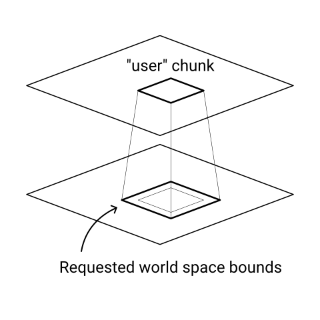
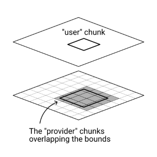
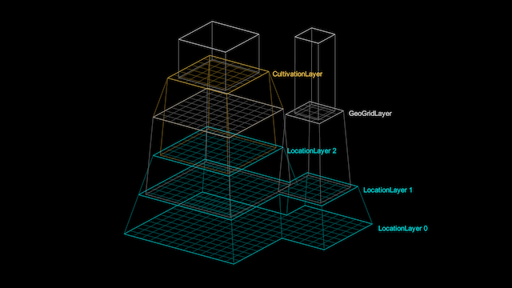

# Layer Dependencies

Deterministic contextual generation is possible by dividing your generation processes into multiple layers and keeping a strict separation between the input and output of each layer.

## Requesting data from another layer

As part of its generation code, a chunk can request data from another layer:

- The chunk requests data within specified world-space bounds.
- Those are generally the bounds of the chunk itself, plus some padding.

In this context we can call the chunk a "user" chunk, since it's using data provided by another layer.



The other layer returns the requested data to the “user” chunk as follows:

- The layer calculates which “provider” chunks overlap the specified bounds. (An implementation detail that the "user" chunk generally doesn't need to know about.)
- It collects and returns the relevant data from those chunks.



Note that “user” and “provider” do not refer to different types of chunks, but specify relations. Chunks are commonly “users” and “providers” at the same time.

## Ensuring "provider" chunks exist

In order for a layer to return data within specified bounds, the “provider” chunks overlapping those bounds must first be generated.

The LayerProcGen framework uses an approach for this where “provider” chunks are generated before the “user” chunk even starts being generated. This means dependencies must be known ahead of time.

We can redefine dependencies between chunks as dependencies between layers:

- In a layer’s constructor, we specify once and for all which other layers it depends on and with how much padding each.
- The layer dependency padding must be the maximal padding of any data requests the layer’s chunks might make to that other layer.
- Before generating a chunk in a given layer, the framework handles each layer dependency: It generates provider chunks based on the bounds of the user chunk plus the padding specified in the layer dependency.
- This is recursive: If the layer of the "provider" chunks also have layer dependencies, the needed chunks from those layers are generated first, and so on.

```cs
// ExampleLayer constructor.
public ExampleLayer() {

	// Dependencies on other layers are set up here with appropriate padding.

	AddLayerDependency(
		new LayerDependency(OtherLayer.instance, new Point(16, 16)));
	AddLayerDependency(
		new LayerDependency(RegionLayer.instance, new Point(100, 100)));
}
```

There is potential for human error when specifying the padding for a layer dependency. If the data requests in the generation code use larger padding than the layer dependency specifies, the data request may be unsuccessful due to the needed chunks not having been generated. However, runtime errors will be logged, and they specify which padding is required to fix the issue.

## Top layer dependencies

Regular layer dependencies ensures that chunks are created when they are needed by other chunks. But to make any chunks be generated in the first place, we need to specify top layer dependencies, as all generation starts with one or more top level dependencies at the root.

A top layer dependency specifies that chunks from a specified layer are required within given bounds. Those bounds are specified as a *focus point* and a *size*, with the focus point indicating the center point of the bounds. Typically a top layer dependency is focused on the player's position in the world.

Multiple top layer dependencies can be specified, and they can depend on different layers. If any chunks in any layers end up being simultaneously needed, directly or indirectly, by more than one top layer dependency, they are only generated once. In other words, overlapping dependencies do not incur any extra cost.



Some typical use cases for top layer dependencies are:

- **Player**: A top layer dependency can be focused on the player or player avatar's position, so the world is generated surrounding the player.
- **Map**: When displaying a map, a top layer dependency can be focused on the current scroll position of the map, so the map is generated for the area that's currently visible on the screen.
- **Debugging**: When debugging or inspecting the procedural generation, a top layer dependency can be focused on what the debug camera is looking on.
- **Fast travel**: If the player needs to teleport or fast travel, a temporary top layer dependency can be created for the destination. Once the generation is completed, the teleportation can take place. After the teleportation, the regular player top level dependency can be moved to the destination too, and the temporary top level dependency can be destroyed or deactivated. This causes the world around the old focus, which is no longer depended on, to be destroyed.

### Different data for different use cases

It's worth noting that different gameplay features may not need the same things generated. Displaying a map can likely skip generation of a lot of data needed only for creating the world in greater detail.

Perhaps generation of the world itself is sufficiently slow that the player can only move with a certain speed through it in order for the generation to keep up. But the generation of the map may be light-weight enough that the player can scroll around the map screen quickly. It's a good idea to design data layers with such concerns in mind.

### Choice of top layers

Generation of a world may not necessarily have a single top layer that a top layer dependency can naturally depend on to trigger generation of all aspects of the world. Maybe a PropsLayer generates static Prefabs like rocks and buildings, while an NPCLayer generates NPCs, and neither depend on the other. Possibly the PropsLayer need to generate props within a larger radius of the player than the NPCLayer needs to generate NPCs.

It's also possible that the PropsLayer depends on a TerrainLayer which generates terrain, but you want the terrain generated in a larger radius than what the PropsLayer needs.

There are two ways to go about this:

- **Use multiple top layer dependencies** with the same focus, e.g. one for the PropsLayer, NPCLayer and TerrainLayer.  
With this approach, each top layer dependency defines the size of the generated area for its layer.
- **Create a separate layer** (for example called PlayLayer) that doesn't do  any generation of its own but simply depends on other layers, e.g. the PropsLayer, NPCLayer and TerrainLayer. A single top layer dependency can then depend on this PlayLayer.  
With this approach, the PlayLayer defines the size of the generated area for each of the layers it depends on, specified as padding in each of its layer dependencies. The PlayLayer can use chunks of the minimum size (1 x 1) and the top layer dependency can use a size of 1 x 1 too.

## Directed acyclic graph of dependencies

In mathematics and computer science, a *graph* is a set of objects with connections between some of them. In a directed acyclic graph (DAG), only one-way connections are allowed, and they may not form *cycle* (loop).

In the LayerProcGen framework, layer dependencies implicitly form a directed acyclic graph, with each layer dependency being a one-way connection between two layers. [Internal layer levels](InternalLayerLevels.md) also count as separate objects in the DAG.

The framework doesn't explicitly build or store this graph structure, but it's implicitly defined by the layer dependencies you specify in your layers.

If you end up creating a lot of layers, it can be useful to map out the dependencies in a visual graph to better be able to keep an overview of which layers and levels depend on which. There is no one right way to design such a visual aid, but here is one example:


