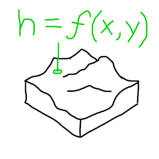
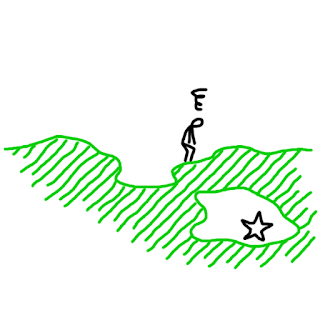
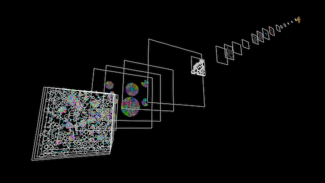
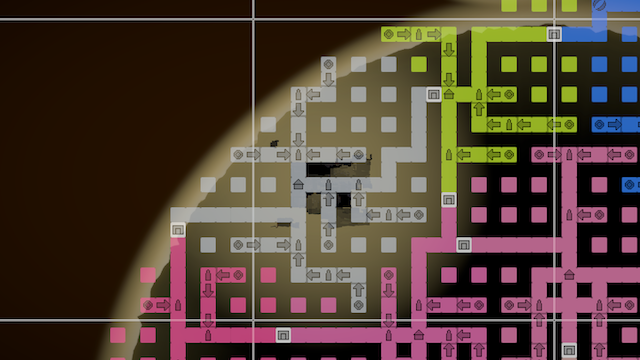

# Planning at Scale

There are many ways to do procedural generation, but two broad approaches that can be contrasted are **the functional approach** and **the planning approach**.

**The functional approach**

- Content is a spatially local function.
- No context of surroundings.
- Common in “open world” procedural games like Minecraft and No Man’s Sky.

 

**The planning approach**

- Generation is top-down.
- Intent behind placement of items, and how things are connected.
- Common in procedural games with finite spaces, such as rogue-likes.

 

## Limitations of the functional approach

The specifics of spaces cannot be planned with intent using the functional approach. It doesn’t know:

- If a cave is connected to the surface.
- If a tall cliff is reachable.

 

Games work around this in a few ways:

- By giving the player generous abilities to reach any point.
- By only placing progression-critical objectives at special trivially reachable spots.

Essentially the functional approach necessitates embracing *sandbox gameplay*.

## The planning approach in infinite games

There are not many, if any, open world (infinite) procedurally generated games using the planning approach at a large scale yet. There is a tendency that infinite games always use the functional approach and involve sandbox gameplay. 

But should that have to be the case?

Using the planning approach in an infinite game is one of the things layer-based generation makes possible. And this allows having procedurally generated open-world games that don't necessarily revolve around sandbox gameplay.

Layer-based generation can have different layers that operate at different levels of abstraction. Chunks can have any size, so chunks in one layer can be orders of magnitude larger than chunks in another layer.

Things that are possible:

- Road signs that point to distant locations.
- Unlocking entire regions based on player progress.
- Having NPCs talk about things at the other side of the continent.

Top-down planning is what makes these things possible. It's hard to generalize how to do this, but the following is an example from an actual implementation.

## Top-down planning example from The Cluster

In the 2.5D platformer game The Cluster, the player must find and activate all artefacts in a region to be able to free that region. The artefacts can be found via exploration alone, but there are shrines at various locations where the player can get assistance. At those shrines, shrine spirits can locate the approximate location of the nearest artefact not yet found, which is marked in a circle on the player's map.

A MazeLayer with MazeChunks create sparse maze-like areas for the platformer gameplay. Each chunk creates an area of a size similar to one "stage" in a stage-based game, but there are potential connections at the top, bottom and sides to adjacent areas.

A RegionLayer with RegionChunks plan out regions in a big grid, each region encompassing around 50 areas, though some of them are simply solid ground. The RegionLayer plans the main paths through a region which connect a central village, gates to neighboring regions, and shrines at certain locations along the way. It also plans paths not shown on the player's map which lead to artefacts at hidden locations.

Every second cell in the RegionLayer grid corresponds to one MazeChunk area. In its generation code, a MazeChunk queries data from the RegionLayer about presence of connections to adjacent areas, presence of any special locations in the chunk (shrine, village, gate, artefact), and whether the area is above ground or underground. The MazeChunk generates an area according to those specifications. 

The RegionLayer also has information about which of the four directions lead to nearby shrines, gates, or the village (which each have unique names). The MazeLayer uses this information to place road signs at relevant junctions in its own generated paths.

In the debug visualization above, each region has a different debug color. You may notice that there isn't a one-to-one relationship between regions and RegionChunks. The regions are generated according to the "owned within bounds" principle described on the page about [software patterns for layers](Patterns.md). The area coverage of regions is generated by an even larger-scale layer called the WorldLayer, whereas the RegionLayer plans the content of individual regions.

## Building up from the bottom

While top-down planning (encoded in the generation processes of a game) is ultimately the way to generate a game world that feels planned at scale with intent, it can be a daunting prospect when starting from scratch. It may be easier to start planning and implementing the smaller scale layers first.

In The Cluster, the MazeLayer was implemented before the RegionLayer was even conceived of. The initial focus was just to make traversal and exploration in each individual area satisfying. As the game evolved and took shape, the RegionLayer was added, and the MazeChunk code was altered to take specifications from that RegionLayer.

In other words, it can be a good strategy to start with implementing gameplay and features that are focused locally around the player. Once that is working, if the game feels like it could benefit from being interconnected at a larger scale, or having a larger plan or sense of purpose, that can be a good time to add a layer that plan such things out at a larger scope.
