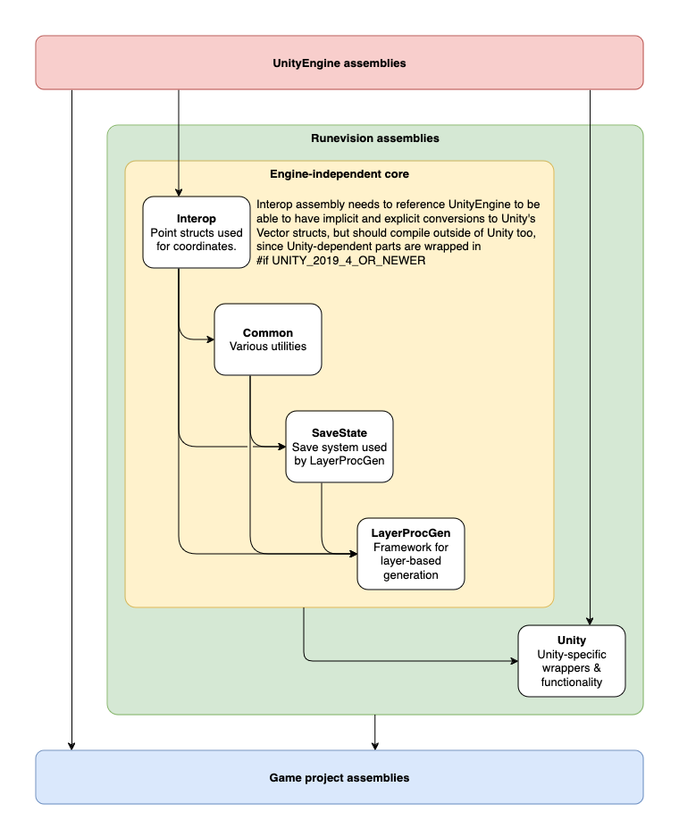

## Using Without Unity

Although only tested in Unity, LayerProcGen is designed to run in any C#-compatible engine by having the core framework not depend on any Unity assemblies or API.

The contents of these folders depend on Unity API and can be removed:

* Unity
* Interop/UnitySpecific

Here is a diagram of the assemblies and the dependencies between them:

The Interop/UnitySpecific folder is just conversions between LayerProcGen types and Unity types like Vector2 and Vector3. Even without removing it, the code should still compile outside of Unity since Unity-dependent parts are wrapped in #if UNITY_2019_4_OR_NEWER.

The Unity folder contains Unity engine hooks and utilities in a variety of classes as noted below. Some of these may be useful as reference points if you wish to implement equivalent functionality in another engine.

## Unity-specific classes

There are Unity components serving as wrapper classes which ensure central objects are created.

* `GenerationSource`: A Unity component that sets up a TopLayerDependency. In other engines, TopLayerDependency objects must be setup by other means.
* `LayerManagerBehavior`: A Unity component that wraps the central LayerManager class. In other engines, a LayerManager object must be created by other means.
* `ForwardingUnityWrapper`: A static class that forwards log messages from the framework's Logg class to Unity's Debug.Log API and forwards certain calls from the framework's SimpleProfiler class to Unity's Profiler API.

There are a few classes that assist with handling lifetime of Unity Objects across the boundary between generation threads and the main thread. No equivalent may be needed in other engines if they allow engine object manipulation outside of the main thread.

* `TransformWrapper`: This class assists with scheduling object instantiations on the main thread under a given parent Transform.
* `QueuedGameObjectDestruction`: A struct that implements IQueuedAction and can be scheduled on the MainThreadActionQueue to destroy all GameObjects under a specific TransformWrapper.

Furthermore there are some non-critical but still useful utilities that have fully or partially Unity-dependent implementations. See the [Utilities](Utilities.md) page for details on which ones.
